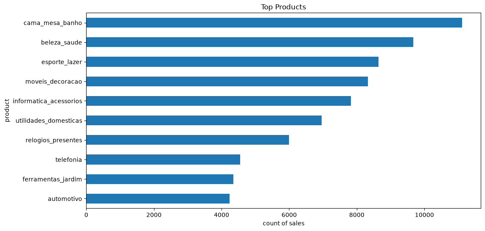
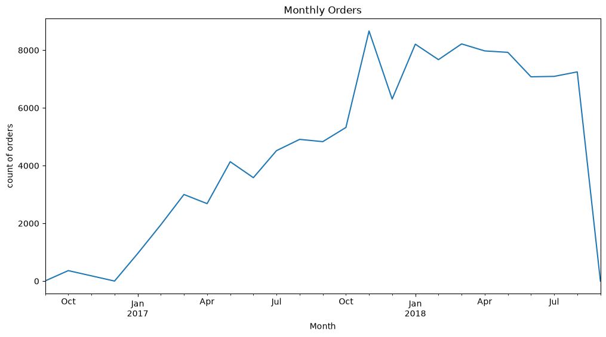
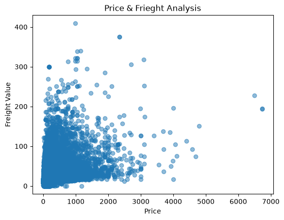

🚀 Brazilian E-Commerce Data Analysis Project
📌 Project Overview
This project aims to analyze the sales performance and logistical patterns of a major e-commerce platform. The goal is to transform raw, fragmented data into meaningful business intelligence regarding sales trends, product popularity, and shipping efficiency.

Visualizations

  

  

  

## 🛠 Tech Stack & Environment

### 💻 Development Environment

### 📚 Libraries Used
In this project, the following key libraries were utilized for data processing and visualization:

* **Data Manipulation:**
  * `Pandas`: For efficient data structures and data analysis.
  * `NumPy`: For high-performance scientific computing and array operations.

* **Data Visualization:**
  * `Matplotlib`: For creating static, interactive, and animated visualizations.

📈 Key Analysis & Insights
1. Data Integration & Cleaning
Successfully merged disparate datasets (Customers, Orders, Items, Payments, and Products) into a unified analytical structure.
Handled data type conversions (e.g., datetime optimization) to ensure accurate time-series analysis.
2. Time-Series Analysis (Sales Trends)
Finding: Analyzed monthly sales volume to identify growth patterns.
Insight: Observed a consistent upward trend in orders, providing a baseline for seasonal forecasting.
3. Product Category Performance
Finding: Identified the Top 10 product categories by order volume.
Insight: Provided visibility into which segments drive the highest transaction frequency, aiding in inventory prioritization.
4. Pricing vs. Logistics Analysis
Finding: Conducted a scatter plot analysis of product_price vs. freight_value.
Insight: Discovered a lack of correlation between price and shipping costs. This indicates that shipping expenses are driven by physical attributes (weight/dimensions) rather than product value, suggesting opportunities for optimizing logistics through better packaging or weight-based pricing.
🚀 How to Run
Clone the repository.
Install requirements: pip install pandas numpy matplotlib.
Run the Jupyter Notebook to see the full analysis and visualizations.
